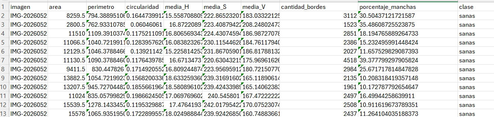
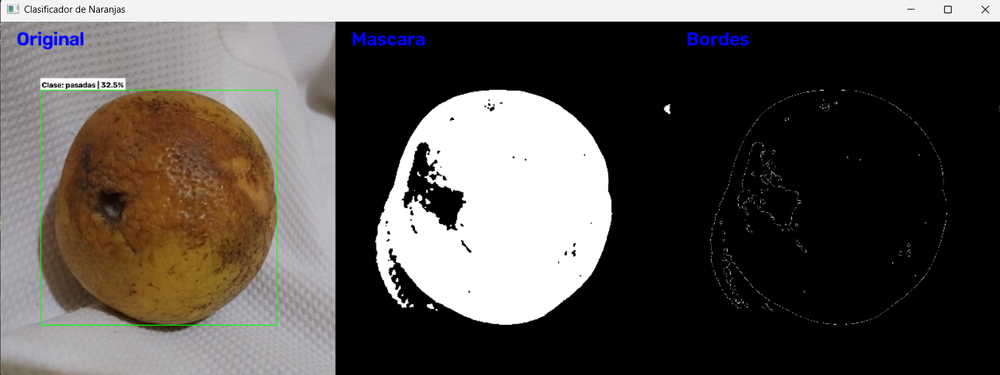

# Clasificador-de-naranjas

## Descripción del proyecto

Este proyecto consiste en el desarrollo de un sistema capaz de clasificar naranjas según su estado de maduración y calidad utilizando técnicas de **procesamiento digital de imágenes** y **aprendizaje automático (Machine Learning)**.

El objetivo principal es analizar características visuales de una naranja a partir de una imagen y determinar su clase correspondiente:

-  Sana
-  Verde
-  Pasada
- Dañada

Actualmente el sistema trabaja con imágenes individuales y se tiene como objetivo futuro realizar pruebas en tiempo real mediante la cámara de un celular conectada a Python.

---

# Dataset

Para la creación del conjunto de datos se realizaron aproximadamente **100 fotografías de naranjas**, distribuidas entre las diferentes clases del proyecto.

Las imágenes fueron organizadas en carpetas según su categoría y posteriormente procesadas mediante Python para obtener información cuantificable de cada naranja.

A partir de estas imágenes se generó un archivo CSV con las características extraídas, el cual fue utilizado para entrenar el modelo de clasificación.

---

# Procesamiento de imágenes

Antes del entrenamiento del modelo, cada imagen pasó por diferentes etapas de procesamiento digital:

###  Conversión y suavizado de imágenes

Las imágenes originales fueron preparadas aplicando técnicas de reducción de ruido para mejorar la segmentación posterior.

###  Segmentación

Se realizó una separación entre la naranja y el fondo mediante técnicas de procesamiento de imagen, obteniendo una máscara de la región de interés.

### Operaciones morfológicas

Se aplicaron operaciones morfológicas para mejorar la máscara obtenida:

- Eliminación de ruido
- Cierre de pequeños espacios
- Mejora de la región detectada

### Detección de bordes

Se utilizó el detector de bordes de **Canny** para obtener información del contorno de la naranja.

---

# Extracción de características

Después del procesamiento digital de las imágenes, se obtuvieron diferentes características numéricas de cada naranja. Estas variables fueron almacenadas en un archivo CSV generado mediante Python, el cual posteriormente fue utilizado para entrenar el modelo de clasificación.

Las características extraídas incluyen:

- Área de la naranja.
- Perímetro del contorno.
- Circularidad.
- Valores promedio del espacio de color HSV (H, S y V).
- Cantidad de bordes detectados mediante Canny.
- Porcentaje de manchas.
- Clase correspondiente de la naranja.

Ejemplo del archivo generado con las características extraídas:



Estas características fueron almacenadas en un archivo CSV para posteriormente entrenar el modelo.

---

# Entrenamiento del modelo

Para la clasificación se utilizó un algoritmo de random Forest, entrenado con las características obtenidas del procesamiento de imágenes.

El modelo entrenado fue almacenado mediante un archivo:

```
modelo_naranjas.pkl
```

Además, se guardaron las columnas utilizadas durante el entrenamiento:

```
columnas_modelo.pkl
```

Esto permite utilizar posteriormente el modelo con nuevas imágenes sin necesidad de volver a entrenarlo.

---

#  Resultados obtenidos

El modelo alcanzó un rendimiento de:

## Accuracy:
### 88.98%

Este resultado indica que el modelo logra clasificar correctamente la mayoría de las imágenes según el estado de la naranja.

---

# Sistema de prueba

Se desarrolló un script para probar el modelo con nuevas imágenes.

El sistema permite:

1. Seleccionar una imagen de prueba.
2. Procesar automáticamente la naranja.
3. Extraer sus características.
4. Enviar los datos al modelo entrenado.
5. Obtener la predicción.

La interfaz muestra:

- Imagen original.
- Rectángulo de selección de la naranja.
- Clase predicha.
- Porcentaje de confianza de la predicción.
- Máscara obtenida durante la segmentación.
- Bordes detectados mediante Canny.

Ejemplo del resultado:

```
Clase: madura | 95.4%
```
Ejemplo del resultado:


---

#  Tecnologías utilizadas

- Python
- OpenCV
- Pandas
- Scikit-learn
- NumPy
- Joblib
- Random Forest
- Procesamiento digital de imágenes


